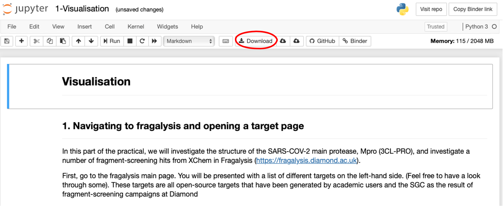
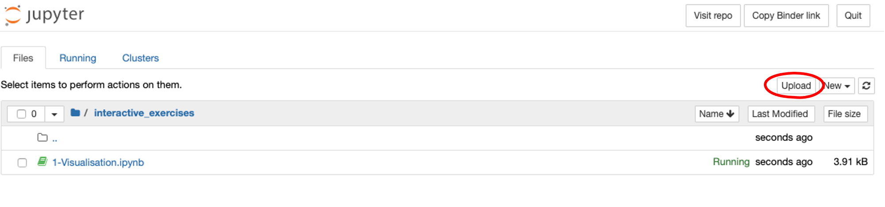

[](https://mybinder.org/v2/gh/xchem/strucbio_practical/master)

# XChem Structural Biology Practical

# Interactive mode (for students)

## Run from Binder (recommended)
To launch this practical in an interactive mode in your browser, without the need to install anything, you can click the
 'launch binder' button above. This will redirect you to a page on ``binder.org`, and will launch a server for you. The 
 launch should take no more than a couple of minutes. 
 
 When the server is launched, you will see a Jupyter notebook home page. To access the interactive parts of the 
 practical, navigate to [interactive_exercises](interactive_exercises). The exercises are labelled by number
 
 From there you can use the Jupyer notebooks in the usual way. If you haven't used Jupyter notebooks before, there is a 
 good tutorial here: https://www.dataquest.io/blog/jupyter-notebook-tutorial/. If you choose to run the practical through
 binder, you can ignore the installation described in the tutorial. If you wish to install a version of the material in
 this repository for use or development locally, you can follow the 'install instructions'. 
 
 Alternativley, a docker container with everything you need (tested on Linux and Mac) is available from Dockerhub. You
 can download it with ``docker pull xchem/strucbio-practical:latest``. See Developer mode > Running the environment and 
 launching jupyter for instructions on how to run the practical locally.
 
 ## Downloading completed exercises from Binder
 The binder server can be used to complete the interactive exercises. However, the data will be deleted from the Jupyter
 notebooks when you close the browser of refresh the page. To  download a copy of the completed exercise, click on the
 ``Download`` button in the menu bar of the jupyter notebook.  
 
 

 This willl save a copy of your work to your local computer. If you want to view this in Binder, you can upload the file 
 directly onto the binder server by navigating to the Jupyer home page, and clicking on the ``Upload`` button.
 
  
  
  
## Links you might need during the practical:
Fragalysis: https://fragalysis.diamond.ac.uk   
 
# Developer mode

## Requirements
Docker or anaconda

## Install instructions
### Option 1: Using a docker container
To use the python packages required for the practical, and access the material in an isolated environment, you might 
want to set up a working environment in a docker container. To do this, you can either build the container locally using 
the [Dockerfile-base](Dockerfile-base) in this repository (more complicated), or pull a copy of the image straight from 
dockerhub.  

1. Building from this repository:
```bash
git clone https://github.com/xchem/strucbio_practical
cd strucbio_practical 
docker build -t strucbio .
```  

2. Pulling the image from dockerhub **(easiest)**
```bash
docker pull xchem/strucbio-practical:latest
```

### Option 2: Using an anaconda envrionment (untested)
You can also use an anaconda environment, especially if you are having trouble installing docker for any reason.  **(hardest)**
Note - there are many extra libraries needed for the install to work correctly. You may want to check the Dockerfile-base
to determine your requirements
```bash
git clone https://github.com/xchem/strucbio_practical
cd strucbio_practical 
conda env create -f environment.yml
source activate frag-api
```

## Running the environment and launching jupyter
### Docker container
This practical will be run using jupyter notebooks. To ensure we can view the notebooks locally in our browser, we must map port 8888 from the
container to our localhost with ``-p 8888:8888`` when we use ``docker run``. Additionally, we want to run the container interactivley with access
to a bash console. To do this, we specify the ``-i`` flag, and the ``/bin/bash`` shell.  

The command to do this:
```bash
docker run -p 8888:8888 -i -t xchem/strucbio-practical /bin/bash
```

Next, to start the jupyter notebook server from within the container:
```bash
jupyter notebook --ip 0.0.0.0 --no-browser --allow-root
```  

This should start the notebook server. There will be a message in the container similar to:
```bash
[I 14:12:29.104 NotebookApp] JupyterLab extension loaded from /opt/conda/lib/python3.8/site-packages/jupyterlab
[I 14:12:29.104 NotebookApp] JupyterLab application directory is /opt/conda/share/jupyter/lab
[I 14:12:29.108 NotebookApp] Serving notebooks from local directory: /strucbio_practical
[I 14:12:29.108 NotebookApp] The Jupyter Notebook is running at:
[I 14:12:29.108 NotebookApp] http://5288af3b4be2:8888/?token=21c4c0ec06b330c582e95425cf74954bf4027a20724dc5dd
[I 14:12:29.108 NotebookApp]  or http://127.0.0.1:8888/?token=21c4c0ec06b330c582e95425cf74954bf4027a20724dc5dd
[I 14:12:29.108 NotebookApp] Use Control-C to stop this server and shut down all kernels (twice to skip confirmation).
[C 14:12:29.114 NotebookApp] 
    
    To access the notebook, open this file in a browser:
        file:///root/.local/share/jupyter/runtime/nbserver-14-open.html
    Or copy and paste one of these URLs:
        http://5288af3b4be2:8888/?token=21c4c0ec06b330c582e95425cf74954bf4027a20724dc5dd
     or http://127.0.0.1:8888/?token=21c4c0ec06b330c582e95425cf74954bf4027a20724dc5dd
 ```   
 
 Copy one of the URLs in the output into your browser. You should now see the jupyter home page
 
 ### Anaconda environment
 Launching the jupyter notebook server with anaconda is slighlty less complicated:
 ```bash
 source activate fragalysis-api
 jupyter notebook
 ```
 This should open up the jupyter home page in your default browser
     
## Developing tutorial material locally
If you have made a clone of this repository in order to adapt or add tutorial material, you may want to bind the local
copy of the repo into the docker container. To do this you can run the ``docker run`` command with
an added argument for a mounted volume:

```bash
repo=$(pwd)
docker run -p 8888:8888 --mount type=bind,source=$repo,target=/strucbio_practical \
    -i -t xchem/strucbio-practical /bin/bash
```
    
